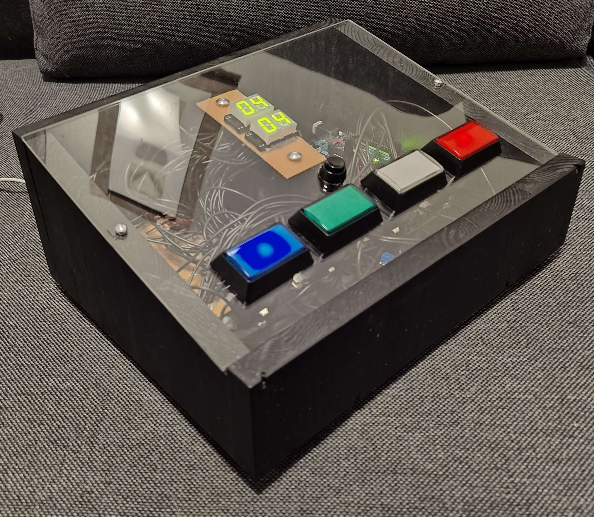

# SpedenSpelit-SpeedTest (school project)
This Arduino project was inspired by the infamous SpedenSpelit-Nopeuspeli (speed test) game. 
The idea of this game is to keep pressing buttons in the same order as their corresponding LEDs as the game keeps getting faster and faster in the interval of 10 LEDs being lit. 
The game will end if the user presses the wrong button.
An Arduino simulator demo of this project can be found here: https://wokwi.com/projects/396601391937473537

---

This school project was made in 2023 during our 1st year of study during the 2nd period at Oulu University of Applied Sciences.

Co-creators:
https://github.com/doctorserious
AND
https://github.com/jgxjgx1

---

